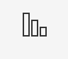

### Installation

```command
pip install -r requirements.txt
```

### Usage

```command
# Outputs to terminal
python report.py <sprint_id>

# Outputs to file
python report.py <sprint_id> > sprint_id.md
```

### Finding the proper sprint id

To find a proper value for `<sprint_id>`, you can go to your JIRA board, click
the 'reports' button, and look at the end of the URL to find a value that looks
like `?rapidView=103&view=reporting&chart=burndownChart&sprint=287` where `287`
is the value you're looking for.

The "reports" button looks like this:

